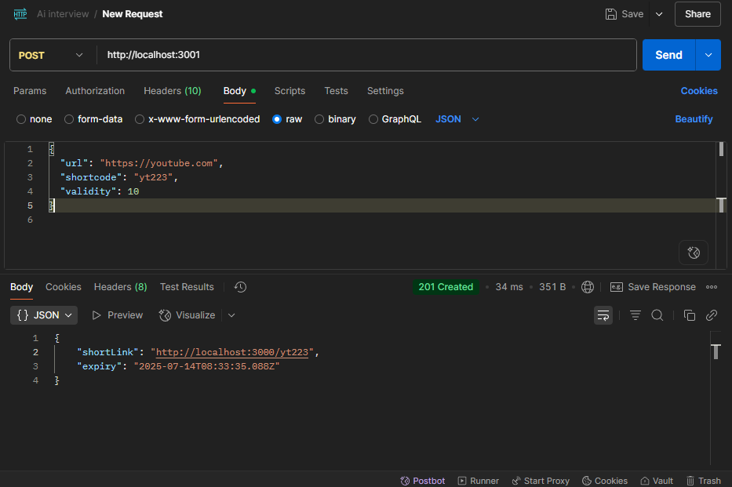

# 🔗 URL Shortener App

A modern, full-stack URL shortener that allows users to generate short links from long URLs, set expiry times, track usage statistics, and optionally assign custom shortcodes.

Built with **TypeScript**, **Express**, **React**, and **Material UI** for a scalable and developer-friendly experience.

---

## 📦 Features

- 🔐 Custom shortcodes (optional)  
- ⏳ Expiry time setting per URL  
- 📊 Real-time click statistics (referrer, IP/location, timestamp)  
- ✨ Clean UI with MUI and responsive layout  
- 📁 Local in-memory storage (can be swapped with Redis/DB)  
- 🪵 Frontend and backend logging with async logging utility

---

## 🧱 Architecture

This project follows a modular **client-server architecture** with clear separation of concerns:

### 1. **Frontend (React + TypeScript + MUI)**
- **Pages**
  - `Home.tsx`: Entry point for URL shortening
  - `StatsPage.tsx`: Visualizes stats for previously shortened URLs
- **Components**
  - `ShortenerForm.tsx`: Form to input and shorten multiple URLs
  - `StatsPage.tsx`: Renders stats as cards using MUI
- **Logging**
  - `logFrontend()`: Sends logs to backend with level and context info
- **State Management**
  - React `useState` and `useEffect` for local state
  - Session storage for temporary shortcode persistence

### 2. **Backend (Express + TypeScript)**
- **Routes**
  - `POST /shorturls`: Create a new shortened URL
  - `GET /shorturls/stats/:shortcode`: Fetch click stats
  - `GET /shorturls/:shortcode`: Redirect to the original URL
- **Controllers**
  - Input validation
  - Service delegation
- **Services**
  - `createUrlEntry`: Generates and stores a short URL entry
  - `getUrlStats`: Gathers and returns analytics for a shortcode
- **Storage**
  - In-memory `Map` to mimic persistent storage
  - `UrlEntry` interface for structure
- **Logger**
  - Async backend logger that writes logs with timestamps and tags

---

## 📁 Folder Structure

```plaintext
├── backend/
│   ├── controllers/
│   ├── db/
│   ├── routes/
│   └── ...
├── frontend/
│   ├── components/
│   ├── pages/
│   └── ...
└── README.md
```

yaml
Copy
Edit

---

## 🛠️ Technologies Used

### Frontend:
- [React](https://reactjs.org/)
- [TypeScript](https://www.typescriptlang.org/)
- [Material UI](https://mui.com/)
- [Axios](https://axios-http.com/)

### Backend:
- [Express.js](https://expressjs.com/)
- [TypeScript](https://www.typescriptlang.org/)
- [uuid](https://www.npmjs.com/package/uuid)
- [cors](https://www.npmjs.com/package/cors)

---

## 🚀 Getting Started

### Prerequisites
- Node.js v18+
- npm or yarn

---

### 🧩 Backend Setup

```bash
cd BackendTestSubmission 
npm install
npm run dev  # or `npm run start` for production
The backend runs by default on http://localhost:3001.

🌐 Frontend Setup
cd FrontendTestSubmission
cd FrontendTestSubmission
npm install
npm run dev
The frontend runs by default on http://localhost:3001.

🧪 Test Process
Manual validation of shortening form (valid/invalid URLs)

Expiry tested by setting short TTLs and checking redirect logic

Stats tested using multiple browsers and incognito tabs

Logging checked in both frontend and backend consoles

⚙️ Environment & Config Notes
Shortened links are served from: http://localhost:3001/:shortcode

Stats endpoint: GET http://localhost:3001/stats/:shortcode

URLs are stored in-memory for now — ideal for demos or testing. You can swap with persistent DB (e.g., PostgreSQL or Redis) easily.

🧼 Logging
Each major component logs user and error activity:

Frontend:

Visited Home/Stats

Shortened URL

Error shortening URL

Backend:

Shortcode created

Redirected

Shortcode not found or expired

Stats fetched

🔒 Security & Limitations
Max 5 inputs per request (client-controlled)

Shortcode uniqueness enforced

No external rate-limiting or IP-blocking (can be added for production)

📝 Future Improvements
Add user authentication

Connect to Redis or PostgreSQL for persistence

Track location more accurately using GeoIP

Click rate analytics over time

QR code generation for shortened links


📌 Summary
This project demonstrates:

A full-stack TypeScript application

Clean folder separation and layering

Practical use of in-memory storage

Reusable UI components with a great UX

Logging practices useful in real-world debugging and auditing

```

## 📸 Screenshots & Testing Proof

---

### 🏠 Home Page
The main landing page of the URL Shortener app. Users can input up to 5 long URLs, with optional expiry time and custom shortcodes.


---

### 🧪 Home Page with Input
Shows a filled-out form with multiple entries, ready for shortening. Demonstrates optional fields like validity and shortcode.


---

### 🔗 Result Page
Once the URLs are shortened, results appear below with the original URL, shortened link, and expiry timestamp.


---

### 📊 Stats Page
Displays a list of all previously shortened URLs, total clicks, expiry, and a detailed click history including referrer and IP.


---

### 🧪 Postman – Create Short URL
This Postman request hits the `POST /shorturls` route with required and optional fields. A valid response returns a short link and expiry.


---

### 🧪 Postman – Get Stats
This Postman request hits the `GET /stats/:shortcode` endpoint to retrieve click statistics and metadata for the given shortcode.


---
